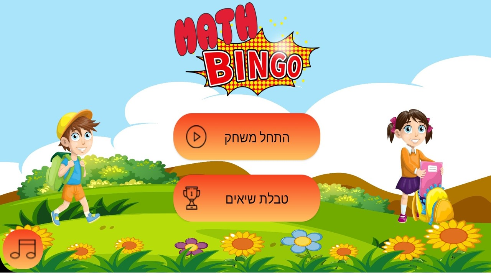

 Bingo game app which is designed to teach kids mathematics. The APP Purpose is to
teach meth in different degrees of difficulty and in different meth actions in fun and
enjoyable way. the app is written in Java (using Android Studio).

       

 
          
 
 
 
